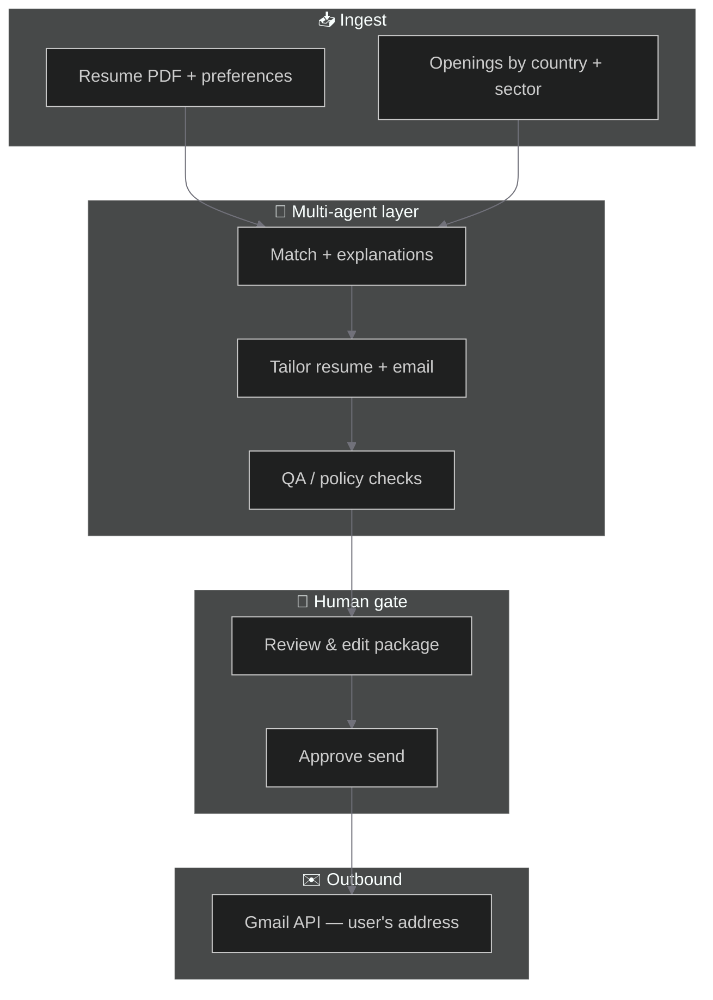

<div align="center">

<!-- Animated hero: cycles taglines (readme-typing-svg) -->
<a href="#-daubo">
  
</a>

<br />

<!-- Stack & status badges -->
[](https://nextjs.org/)
[](https://react.dev/)
[](https://www.typescriptlang.org/)
[](https://tailwindcss.com/)

<br />

[](https://nodejs.org/)
[](LICENSE)

**Daubo** is a multi-agent career assistant for **any sector and country you target** (care, trades, logistics, education, finance, hospitality, technology, and beyond): it matches openings to your profile, generates a **job-specific resume** and application package, and—after you connect Gmail and **approve**—sends from **your address** so threads and replies stay yours. Interview prep reuses the same context.

[Features](#-features) · [Architecture](#-architecture) · [Quick start](#-quick-start) · [Scripts](#-scripts) · [Structure](#-project-structure)

</div>

---

## ✨ Features

| | Capability |
|--|------------|
| 🤖 | **Orchestrated agents** — Match, tailor, QA, and packaging steps with structured outputs (LangGraph-ready). |
| 📄 | **Resume per offer** — Tailored PDF/text variant aligned to each job description, not one static CV for everyone. |
| ✉️ | **Your inbox** — Gmail OAuth path to send applications *as you*, with personalized attachment + body. |
| ✅ | **Approval gates** — Nothing mails without explicit sign-off per application. |
| 📊 | **Pipeline dashboard** — Dark, high-clarity UI: pipeline trend, apply package preview, applications table, stage mix. |
| 🌍 | **Global, all-industry discovery** — Country- and sector-aware matching (not tech-only); ingestion expands with regional job feeds. |
| 🎨 | **Premium shell** — Marketing and dashboard chrome built for Daubo’s dark, high-signal workspace. |

---

## 🏗 Architecture

High-level flow from profile to send:



**Principle:** probabilistic models sit behind a deterministic product layer—schemas, statuses, idempotency, and audit-friendly events (implementation roadmap).

---

## 🚀 Quick start

### Prerequisites

- **Node.js** `>= 20.9` recommended (Next 14 + toolchain); `20.1` may work with warnings.
- **npm** (or swap commands for `pnpm` / `yarn`).

### Install & run

```bash
git clone <your-repo-url> daubo
cd daubo
npm install
npm run dev
```

Open **[http://localhost:3000](http://localhost:3000)** — marketing site.  
Open **[http://localhost:3000/dashboard](http://localhost:3000/dashboard)** — workspace preview.

### Production build

```bash
npm run build
npm start
```

### Deploy (Vercel frontend + Railway backend)

**1 — Railway (FastAPI + Postgres)**

1. In [Railway](https://railway.app), create a project and deploy **from this GitHub repo**.
2. Set the service **root directory** to `backend` so Railway uses [`backend/Dockerfile`](backend/Dockerfile) (or use the included [`backend/railway.toml`](backend/railway.toml)).
3. Add a **PostgreSQL** database (or any Postgres that allows the **`vector`** extension; Daubo runs `CREATE EXTENSION vector` on startup). If your host does not support pgvector, use a pgvector-capable database (e.g. Neon, Supabase) and set `DATABASE_URL` to that connection string.
4. **Variables** on the API service (see [`.env.example`](.env.example)):

   | Variable | Notes |
   |----------|--------|
   | `DATABASE_URL` | Reference Railway Postgres `${{Postgres.DATABASE_URL}}` or paste a URL. Plain `postgres://` / `postgresql://` is normalized to **`postgresql+asyncpg://`** in code. |
   | `APP_ENVIRONMENT` | `production` (Dockerfile default is already production). |
   | `BACKEND_CORS_ORIGINS` | Your Vercel URL(s), comma-separated, e.g. `https://your-app.vercel.app` (and preview URLs if you need them). |
   | `DAUBO_INTERNAL_API_SECRET` | Long random string; **same value** on Vercel (below). |
   | `EXPOSE_OPENAPI` | `false` in production unless you want public `/docs`. |
   | `TRUSTED_HOSTS` | Optional; comma-separated hostnames of your Railway **public** API URL (see Railway networking docs if you use a custom domain). |
   | `OPENROUTER_API_KEY`, `JINA_API_KEY`, etc. | As needed for chat/embeddings. |

5. Generate a **public URL** (or attach a custom domain) for the API. Health check: `GET /health` (used by [`backend/railway.toml`](backend/railway.toml)).

**2 — Vercel (Next.js UI)**

1. Import the same (or frontend-only) repo in [Vercel](https://vercel.com). Use the **default project root** (repository root).
2. **Environment variables:**

   | Variable | Notes |
   |----------|--------|
   | Clerk — `NEXT_PUBLIC_CLERK_PUBLISHABLE_KEY`, `CLERK_SECRET_KEY` | Use **production** keys for production deployment. |
   | Clerk URLs | `NEXT_PUBLIC_CLERK_SIGN_IN_URL`, `NEXT_PUBLIC_CLERK_SIGN_UP_URL`; redirect URLs `NEXT_PUBLIC_CLERK_SIGN_IN_FORCE_REDIRECT_URL` / `…SIGN_UP…` (e.g. `/dashboard`). |
   | `DAUBO_API_URL` | **HTTPS** public base URL of the Railway API, **no trailing slash**, e.g. `https://your-api.up.railway.app`. |
   | `DAUBO_INTERNAL_API_SECRET` | **Identical** to the Railway API service value. |

3. In the [Clerk dashboard](https://dashboard.clerk.com), add your Vercel URLs to **Allowed origins** and **Redirect URLs** as required.

The App Router proxies the browser to the API via [`src/app/api/daubo/[...path]/route.ts`](src/app/api/daubo/[...path]/route.ts). From the client, use `dauboBffUrl()` in [`src/lib/daubo-api.ts`](src/lib/daubo-api.ts).

---

## 📜 Scripts

| Command | Description |
|---------|-------------|
| `npm run dev` | Start dev server ([localhost:3000](http://localhost:3000)) |
| `npm run build` | Production build + typecheck |
| `npm run start` | Serve production build |
| `npm run lint` | ESLint (`next/core-web-vitals`) |
| `npm run backend:dev` | FastAPI with hot reload (from `backend/`, Python venv with deps installed) |

---

## 🧭 Project structure

```
daubo/
├── backend/                 # FastAPI — LangGraph, OpenRouter, Jina, pgvector
│   └── app/
├── src/
│   ├── app/                 # App Router — pages & layouts
│   │   ├── page.tsx         # Marketing landing
│   │   ├── layout.tsx       # Root layout + metadata
│   │   └── dashboard/       # Authenticated workspace (shell + stubs)
│   ├── components/
│   │   ├── daubo/           # Dashboard widgets, sidebar, preview
│   │   ├── landing/         # Landing sections
│   │   ├── dashboard/       # App shell (sidebar routing)
│   │   └── Logo.tsx
│   └── ...
├── public/
├── package.json
├── tailwind.config.ts
├── next.config.mjs
└── README.md
```

---

## 🔌 Roadmap (backend & integrations)

Planned wiring (not all implemented in this UI repo):

- **Accounts** — Secure sign-in and profiles for every Daubo user.
- **Billing** — Plans and entitlements for Free / Pro / Business inside Daubo.
- **Inbox send** — OAuth to your mail provider so applications send as you.
- **Agents** — Daubo’s multi-agent pipeline for country-aware discovery → match → tailor → QA (including `POST /v1/jobs/discover` for guidance and pasted listings; live feeds integrate next).
- **Storage** — Resume blobs + generated PDFs; encrypted refresh tokens.

Environment variables will be documented here as services are connected.

---

## 📄 License

This project is **private** / all rights reserved unless a `LICENSE` file states otherwise.

---

<div align="center">

<sub>Built with care for candidates who want **speed** without surrendering **control**.</sub>

<!-- Optional: subtle pulse divider using unicode -->
<pre>━━━  ◆  ━━━</pre>

</div>
