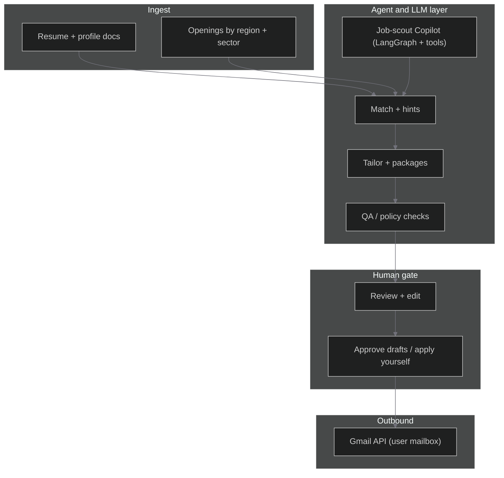

<div align="center">

<!-- Animated hero: cycles taglines (readme-typing-svg) -->
<a href="#project-vision">
  
</a>

<br />

[](https://nextjs.org/)
[](https://react.dev/)
[](https://www.typescriptlang.org/)
[](https://fastapi.tiangolo.com/)
[](https://www.python.org/)

<br />

[](https://nodejs.org/)
[](LICENSE)

**Daubo** is an AI-powered job search and resume assistant. The design is informed by **multi-agent** patterns (specialized behaviors, tool use, and orchestration—similar in spirit to public write-ups on multi-agent research systems): specialized flows collaborate through a **deterministic product layer** (schemas, user identity, stages, and human approval).

[Vision](#project-vision) · [Features](#features) · [Architecture](#architecture) · [Repository layout](#repository-layout) · [Quick start](#quick-start) · [Lang ecosystem](#lang-ecosystem-and-observability) · [Deploy](#deploy-vercel--railway)

</div>

## Project vision

| Pillar | What Daubo does |
|--------|------------------|
| **AI-powered job search** | Discovery, matching, and saved-job workflows—you apply on real employer sites; we help with research, packages, and drafts. |
| **Resume assistant** | Ingest, tailor, and package materials per role; interview prep reuses the same context. |
| **Multi-agent-friendly stack** | LangGraph for the **job-scout** Copilot path; other flows use structured LLM calls and tools. Room to grow toward planner + subgraph patterns without changing the web surface. |

**Product principle:** probabilistic models sit behind explicit gates—**nothing sensitive sends without user approval** (e.g. Gmail drafts, not auto-send to employers).

---

## Features

| | Capability |
|--|------------|
| **Orchestrated agents** | Job-scout ReAct graph plus structured flows for match, packages, and prep (LangGraph-ready). |
| **Resume per offer** | Tailored materials aligned to each posting, not one static CV for every application. |
| **Your inbox** | Optional Gmail OAuth to create **drafts** as you; you edit and send. |
| **Approval gates** | Human sign-off before outbound actions that matter. |
| **Pipeline dashboard** | Dark workspace: applications, discover, interview prep, settings. |
| **Global, multi-sector** | Not tech-only; country- and sector-aware discovery (e.g. Adzuna where configured). |
| **Premium shell** | Next.js App Router, Clerk auth, BFF proxy to FastAPI. |

---

## Architecture

High-level flow from profile to send:



### Multi-agent system (how concepts map to this repo)

Inspired by orchestrator plus specialized agents plus tools, **Daubo's concrete split** is:

| Layer | Role | Where it lives |
|-------|------|----------------|
| **Agents** | Job-scout Copilot (plan to web search tool to answer), match/discover, packaging, chat | `backend/app/graph/job_search_agent.py`, `backend/app/services/`, `backend/app/routers/` |
| **Orchestrator** | HTTP API, auth headers, routing, persistence, background tasks | `backend/app/main.py`, `backend/app/deps/`, `backend/app/middleware/` |
| **Tools** | Tavily (scout), Adzuna, OpenRouter, Jina embeddings, parsers | `backend/app/services/` |
| **Interface** | Marketing plus authenticated dashboard, CopilotKit sidebar | `src/app/`, `src/components/` |
| **Data** | Postgres + pgvector, SQLAlchemy models | `backend/app/models.py`, `backend/app/db.py` |

**Web surface for the graph:** FastAPI exposes **`POST /v1/ag-ui/job-search`** (AG-UI). Next.js **`/api/copilotkit`** uses CopilotKit's `LangGraphHttpAgent` against that URL, with Clerk on the BFF and **`X-Daubo-User-Id`** plus **`X-Daubo-Internal-Key`** when configured.

**Evolution:** Today's job-scout is **one** LangGraph **ReAct** agent with tools. A **planner** that routes to **multiple subgraphs** (research / tailor / score) would be an extra graph layer; the same AG-UI/CopilotKit endpoint can wrap it later.

### Implementation reference

| Idea | In code |
|------|---------|
| Resume ingest | PDF, DOCX, vision-backed images when OpenRouter is set; text in DB. |
| Discover / match | `POST /v1/jobs/discover`, resume hints, auto-match jobs—see `me`, `jobs` routers. |
| Scout agent | `create_react_agent` + Tavily tool in `job_search_agent.py`. |
| Dashboard BFF | `src/app/api/daubo/[...path]/route.ts` — Clerk session to `X-Daubo-User-Id`. |

---

## Repository layout

```
daubo/
├── backend/                      # FastAPI — Python 3.11+
│   ├── app/
│   │   ├── main.py               # App factory, CORS, AG-UI mount, health
│   │   ├── config.py             # Pydantic settings / env
│   │   ├── db.py                 # Async SQLAlchemy + init
│   │   ├── models.py             # ORM models
│   │   ├── deps/                 # Auth helpers (internal key, user header)
│   │   ├── graph/
│   │   │   └── job_search_agent.py
│   │   ├── middleware/
│   │   ├── routers/              # health, chat, jobs, me, chunks, embeddings
│   │   ├── schemas/
│   │   └── services/             # LLM, Tavily, Adzuna, Gmail, autopilot, …
│   ├── Dockerfile
│   ├── pyproject.toml
│   ├── uv.lock                   # Lockfile when using uv
│   └── railway.toml
├── src/
│   ├── app/                      # Next.js App Router
│   │   ├── api/
│   │   │   ├── daubo/[...path]/  # BFF proxy to FastAPI
│   │   │   └── copilotkit/       # CopilotKit runtime to AG-UI
│   │   ├── auth/                 # Clerk sign-in/up
│   │   ├── dashboard/            # Workspace routes
│   │   ├── pricing/
│   │   └── …
│   ├── components/
│   │   ├── daubo/                # Shell, charts, shared UI
│   │   ├── dashboard/            # Feature cards, onboarding, stats
│   │   └── landing/
│   ├── lib/                      # daubo-api URL helper, OAuth state, …
│   └── middleware.ts             # Clerk protect /dashboard
├── public/
├── package.json
├── next.config.mjs
├── tailwind.config.ts
├── tsconfig.json
├── .env.example                  # Authoritative env template (root + backend)
└── README.md
```

**Why `backend/` plus `src/`?** Keeps Node and Python boundaries clear: Vercel builds the repo root; Railway (or Docker) targets `backend/`. Imports stay predictable (`app.*` inside Python; `@/` aliases in Next).

---

## Quick start

### Prerequisites

- **Node.js** >= **20.9** recommended.
- **Python** >= **3.11** (backend).
- **uv** (recommended for Python) or pip + venv.

### Frontend (Next.js)

```bash
git clone <your-repo-url> daubo
cd daubo
npm install
npm run dev
```

- App: [http://localhost:3000](http://localhost:3000)
- Dashboard (Clerk): [http://localhost:3000/dashboard](http://localhost:3000/dashboard)

Copy [`.env.example`](.env.example) to `.env.local` and set at least Clerk plus `DAUBO_API_URL` when exercising the full stack.

### Backend (FastAPI)

```bash
cd backend
uv sync                    # install locked deps (or: pip install -e .)
# Edit DATABASE_URL and keys in ../.env (backend loads parent .env via pydantic-settings)
```

From the **repo root** (after `uv sync`):

```bash
npm run backend:dev
```

Or from `backend/` with the venv active:

```bash
uv run uvicorn app.main:app --reload --host 0.0.0.0 --port 8000
```

- API: [http://localhost:8000](http://localhost:8000)
- Health: `GET /health`
- Set `EXPOSE_OPENAPI=true` locally for `/docs` if you want OpenAPI UI.

### Production build (frontend)

```bash
npm run build
npm start
```

---

## Lang ecosystem and observability

Daubo uses **LangGraph** and **LangChain**-compatible clients (e.g. OpenRouter via LangChain). There is **no** checked-in `langgraph.json` today—the job-scout graph is **mounted on FastAPI** (`ag_ui_langgraph` / CopilotKit), not run as a standalone LangGraph Platform project. If you add a standalone dev server later, you can follow LangGraph's `langgraph dev` docs for local Studio.

### LangSmith (optional)

To trace LLM and graph runs in development or staging:

1. Create a project and API key at [smith.langchain.com](https://smith.langchain.com).
2. Set environment variables (see [LangChain tracing docs](https://docs.smith.langchain.com)):

```bash
export LANGCHAIN_API_KEY="your_key"
export LANGCHAIN_TRACING_V2="true"
export LANGCHAIN_ENDPOINT="https://api.smith.langchain.com"
export LANGCHAIN_PROJECT="daubo"   # optional
```

3. Run the backend with those vars; traces appear in the LangSmith UI.

### CopilotKit / AG-UI locally

1. Configure `OPENROUTER_API_KEY`, `TAVILY_API_KEY`, and DB in `.env`.
2. Start FastAPI and Next.js.
3. Open the dashboard with the job-scout agent enabled (stats / feature flags in app). The sidebar talks to **`/api/copilotkit`**, which proxies to **`/v1/ag-ui/job-search`** with server-side secrets and Clerk-verified user id.

### Best practices

- **Never** ship production API without **`DAUBO_INTERNAL_API_SECRET`** if the API is public; use the Next BFF and Clerk.
- Enable **LangSmith** (or equivalent) while iterating on prompts and graphs.
- Keep **OpenAPI** off in production (`EXPOSE_OPENAPI=false`) unless you intend to expose `/docs`.

---

## Deploy (Vercel + Railway)

**1 — Railway (FastAPI + Postgres)**

1. Deploy from this repo with service root **`backend`** ([`backend/Dockerfile`](backend/Dockerfile), [`backend/railway.toml`](backend/railway.toml)).
2. Use Postgres with **pgvector**; set `DATABASE_URL`, `APP_ENVIRONMENT=production`, `BACKEND_CORS_ORIGINS`, **`DAUBO_INTERNAL_API_SECRET`**, `OPENROUTER_API_KEY`, `JINA_API_KEY`, etc. See [`.env.example`](.env.example).
3. Railway sets **`PORT`**; the image must bind to it. Health: **`GET /health`**.

**2 — Vercel (Next.js)**

1. Project root = repo root.
2. Set Clerk keys, **`DAUBO_API_URL`** (HTTPS API base, no trailing slash), **`DAUBO_INTERNAL_API_SECRET`** (match Railway), `NEXT_PUBLIC_APP_URL` for OAuth redirects.

Browser traffic uses **`/api/daubo/...`** via [`src/lib/daubo-api.ts`](src/lib/daubo-api.ts) (`dauboBffUrl`).

### Ops runbook

Production hardening and observability playbook lives at:
- [`docs/OPERATIONS-RUNBOOK.md`](docs/OPERATIONS-RUNBOOK.md)

It includes:
- required env contract checks (`npm run check:env:vercel`, `npm run check:env:railway`)
- Prometheus/Grafana wiring and validation
- Sentry verification and release checklist

---

## Scripts

| Command | Description |
|---------|-------------|
| `npm run dev` | Next.js dev server |
| `npm run build` | Production build + typecheck |
| `npm run start` | Serve Next production build |
| `npm run lint` | ESLint |
| `npm run backend:dev` | FastAPI `--reload` (expects deps installed under `backend/`) |

Python (from `backend/`): `uv sync`, `uv run ruff check .` (if using optional dev deps).

---

## Status and roadmap

**In the repo today:** Clerk accounts, resume ingest, discover/match, saved applications, application packages, interview prep, optional Gmail drafts, embeddings/pgvector, CopilotKit job-scout when keys are set, onboarding plus plan picker (client-side).

**Gaps:** Stripe (or similar) entitlements, richer object storage for originals/PDFs, more regional feeds where licensing allows, deeper multi-subgraph orchestration if product needs it.

Environment reference: [`.env.example`](.env.example).

---

## License

This project is **private** / all rights reserved unless a `LICENSE` file states otherwise.

---

<div align="center">

<sub>Built for candidates who want **speed** without surrendering **control**.</sub>

<pre>--- * ---</pre>

</div>
